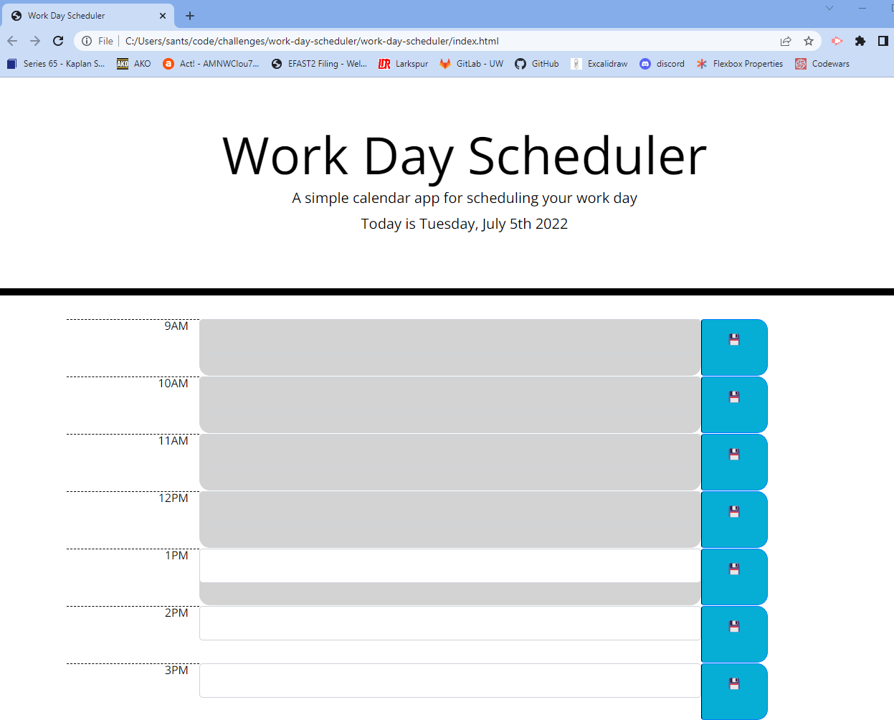

# Work Day Scheduler

## Overview
This project was assigned as an application to store user events utilizing a save button that will be stored until the user clears the events intentionally. Starter code was provided to provide the basic html header framework and css styling. The assignment included the use of Moment.js in the browser to account for color-changing effects based on the time of day, and we are also utilizing third-party frameworks to put the app together more quickly and efficiently since the site is simple. 

## Project Description
The Acceptance Criteria for the project is as follows: 

GIVEN I am using a daily planner to create a schedule

WHEN I open the planner
THEN the current day is displayed at the top of the calendar

WHEN I scroll down
THEN I am presented with timeblocks for standard business hours

WHEN I view the timeblocks for that day
THEN each timeblock is color coded to indicate whether it is in the past, present, or future

WHEN I click into a timeblock
THEN I can enter an event

WHEN I click the save button for that timeblock
THEN the text for that event is saved in local storage

WHEN I refresh the page
THEN the saved events persist

## Run and Install

The deployed Work Day Scheduler can be accessed [here](https://kristensantee.github.io/work-day-scheduler/). A screenshot of the site is shown below:

## Run How to Use the Project

This project was designed to be an exercise in using frameworks and javascript assets but I found it to be very challenging to get some of the criteria met. The timeblocks are supposed to be color-coded which I have coded for around line 104-112 utilizing class styling from the stylesheet but is not fully cooperating at this time and still needs some more tinkering. Additionally, the content the user adds to the inputs is stored locally but does not stay on the page after refresh. I had some planned code from lines 39-48 but couldn't get the code to fully work. I think with more time and more troubleshooting, I could iron out some of the wrinkles. Additionally, the html includes an option that I commented out for a table alternative instead of a grid option which is what I ended up going with. I don't know if that was ultimately the right call so I kept the table breakdown available in case I wanted to revisit it. 

## How to Contribute to the Project
This project was designed to incorporate Moment.js and build on our use of third-party frameworks (Bootstrap, jquery) when building code. The assignment came with starter code for the css and the jumbotron headerand the html body utilized framework options as well. 